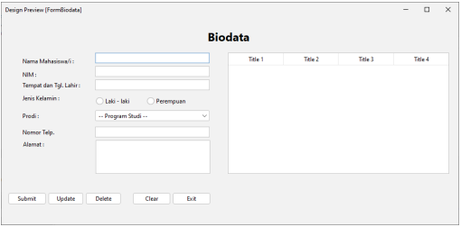
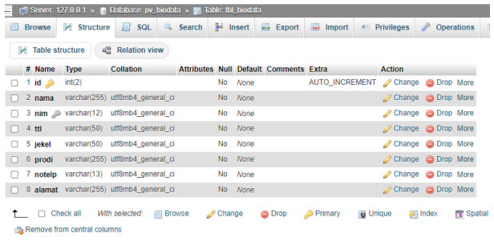

# Tugas UTS Pemrograman Visual Biodata Mahasiswa 
Ini adalah proyek Tugas UTS untuk mata kuliah Pemrograman Visual menggunakan bahasa Java. Aplikasi ini dikembangkan sebagai untuk Menyelesaikan Tugas UTS.

## Informasi Mahasiswa

- **Nama:** oky elviani
- **NIM:**  312310790

## Fitur

- **Create:** Menambahkan biodata mahasiswa baru.
- **Read:** Menampilkan daftar biodata mahasiswa.
- **Update:** Mengubah biodata mahasiswa yang sudah ada.
- **Delete:** Menghapus biodata mahasiswa.

## Screenshot

**Gambar 1: Antarmuka Aplikasi Biodata Mahasiswa**

**Penjelasan:**

Gambar ini menunjukkan tampilan antarmuka aplikasi Biodata Mahasiswa. Aplikasi ini memiliki beberapa komponen, seperti:

- **Label:** Menampilkan teks deskriptif untuk setiap field input.
- **Text Field:** Digunakan untuk memasukkan data seperti nama, NIM, TTL, No. Telepon, dan Alamat.
- **Radio Button:** Digunakan untuk memilih jenis kelamin.
- **ComboBox:** Digunakan untuk memilih program studi.
- **Button:** Digunakan untuk menjalankan operasi seperti Submit, Update, Delete, Clear, dan Exit.
- **Table:** Menampilkan daftar biodata mahasiswa yang tersimpan.

**Gambar 2: Struktur Tabel `tbl_biodata`**

**Penjelasan:**

Gambar ini menunjukkan struktur tabel `tbl_biodata` dalam database Tabel ini memiliki 8 kolom:

- **id:** ID unik untuk setiap data mahasiswa.
- **nama:** Nama mahasiswa.
- **nim:** NIM mahasiswa.
- **ttl:** Tempat tanggal lahir mahasiswa.
- **jekel:** Jenis kelamin mahasiswa.
- **prodi:** Program studi mahasiswa.
- **notelp:** Nomor telepon mahasiswa.
- **alamat:** Alamat mahasiswa. 

## Teknologi

- Java
- Java Swing

## Lisensi

MIT License

---

Semoga bermanfaat!